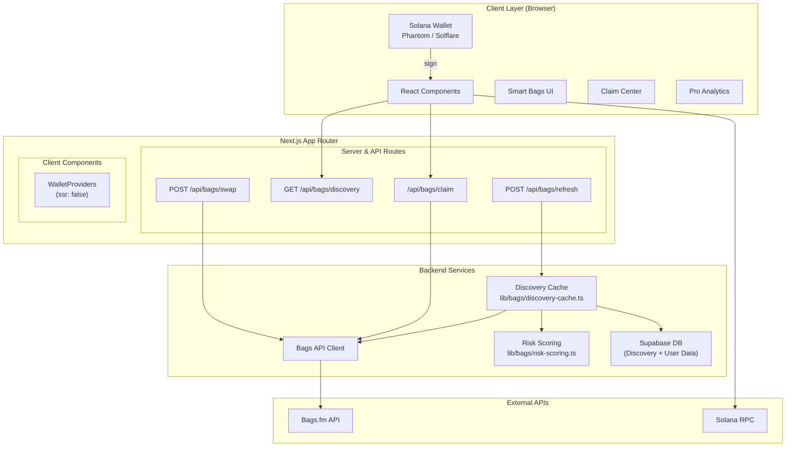

# BagFi Architecture

> Generated from GitNexus knowledge graph analysis  
> **Stats:** 809 nodes | 961 edges | 7 functional areas | 25 execution flows

---

## Overview

BagFi is a unified Web3 asset platform built on **Next.js 15** with **React 18**, focused on Solana-native portfolio management. The application consolidates fragmented crypto holdings into automated, thematic "Smart Bags" — one-click curated portfolios powered by the Bags.fm API.

The architecture follows a **hybrid server/client model**: sensitive operations (API auth, quote fetching, transaction building) run server-side via Next.js API routes, while wallet interactions and UI state management run client-side via Solana Wallet Adapter.

### Technology Stack

| Layer | Technology |
|-------|-----------|
| Framework | Next.js 15 (App Router) |
| UI | React 18, Tailwind CSS, Lucide Icons |
| Wallet | @solana/wallet-adapter-react (Phantom, Solflare, Backpack) |
| Blockchain | @solana/web3.js |
| API | Bags.fm API v1 (server-side proxy) |
| Database | Supabase (PostgreSQL + Auth + RLS) |
| Telemetry | Custom event logger with Sentry integration |
| Testing | Vitest (TS), Hardhat (Solidity) |

---

## Functional Areas

The codebase is organized into **9 functional areas** identified by the knowledge graph:

### 1. App (3 symbols, cohesion: 1.0)
**Files:** `app/layout.tsx`, `app/providers.tsx`, `app/client-providers.tsx`, `app/earnings/page.tsx`

The application bootstrap and routing layer. Uses dynamic imports with `ssr: false` for wallet providers. Added `/earnings` for fee management.

### 2. Dashboard (8 symbols, cohesion: 0.92)
**Files:** `app/page.tsx`, `components/dashboard/*.tsx`, `hooks/use-wallet-balances.ts`

Real-time portfolio overview using on-chain balances. Components fetch native SOL and SPL tokens directly from the Solana RPC.

### 3. Swap & Trade (4 symbols, cohesion: 1.0)
**Files:** `components/swap/swap-terminal.tsx`, `components/swap/transaction-review-modal.tsx`, `app/api/bags/swap/route.ts`

The token swap interface powered by Bags.fm. Includes mandatory transaction simulation and explicit risk warnings.

### 4. Smart Bags (12 symbols, cohesion: 1.0)
**Files:** `lib/smart-bags/catalog.ts`, `lib/smart-bags/session-engine.ts`, `components/bags/*.tsx`

Core product logic for thematic portfolios.
- **Catalog**: Thematic templates (Blue Chip, DeFi Growth, Stable Reserve).
- **Session Engine**: Multi-step deposit splitting, allocation validation, and receipt tracking.
- **Deposit Modal**: Integrated flow for preparing and executing bag investments.

### 5. Bags Discovery & Scoring (15 symbols, cohesion: 0.95)
**Files:** `lib/bags/discovery-cache.ts`, `lib/bags/risk-scoring.ts`, `app/api/bags/discovery/route.ts`

Automated asset discovery and safety filtering.
- **Discovery Cache**: Supabase-backed cache for token launches and liquidity pools.
- **Risk Scoring**: Deterministic eligibility scoring based on metadata, liquidity, and creator reputation.
- **Refresh Coordinator**: Centralized policy for keeping discovery data fresh under API rate limits.

### 6. Analytics (6 symbols, cohesion: 1.0)
**Files:** `app/api/bags/refresh/route.ts`, `components/pro/bags-analytics.tsx`

Deep insights for Pro users. Ingests Bags lifetime fees, claim statistics, and stakeholder distributions.

### 7. Fee Claiming (5 symbols, cohesion: 1.0)
**Files:** `app/api/bags/claim/route.ts`, `components/bags/claim-center.tsx`

The "Earnings" interface for stakeholders. Allows users to view and claim accumulated fees from Bags ecosystem assets.

### 8. Leaderboard (9 symbols, cohesion: 0.89)
**Files:** `app/leaderboard/page.tsx`, `components/leaderboard/leaderboard.tsx`

Community leaderboard showing top-performing Smart Bags. Integrates with Supabase to fetch public user profiles.

### 9. Infrastructure (10 symbols, cohesion: 1.0)
**Files:** `lib/telemetry.ts`, `lib/env.js`, `lib/database.ts`, `lib/bags/client.ts`

Shared services and API wrappers. Centralized Bags client with retries, rate-limiting, and error normalization.

---

## Key Execution Flows

### Flow 1: Bags Discovery Refresh
**Process:** `Background Job → POST /api/bags/refresh → Refresh Coordinator → Bags API → Supabase`

```
1. POST /api/bags/refresh (Authorized)
   └── Triggers refreshAllBagsData()

2. Refresh Coordinator (Server)
   ├── Check expiration of Discovery (5m), Scoring (15m), Analytics (30m)
   ├── Fetch fresh data from Bags API
   ├── Apply Risk Scoring to new launches
   └── Upsert results to Supabase tables
```

### Flow 2: Smart Bag Deposit
**Process:** `BagCard → DepositModal → Session Engine → Prepare → Simulate → Sign`

```
1. User enters deposit amount (e.g., 10 SOL)
2. Session Engine splits amount by BPS allocations (e.g., 4 SOL to JUP, 6 SOL to JitoSOL)
3. For each leg:
   ├── Fetch swap quote from Bags API
   ├── Prepare serialized transaction
   └── Create quote snapshot
4. UI displays full plan and mandatory "Simulate" step
5. User approvals triggered per transaction in sequence
```

### Flow 3: Fee Claiming
**Process:** `ClaimCenter → GET /api/bags/claim → Bags API → POST /api/bags/claim → Wallet`

```
1. GET /api/bags/claim?userPublicKey=...
   └── Returns list of tokens with claimable fees
2. User clicks "Claim" on a specific asset
3. POST /api/bags/claim to generate claim transactions
4. Wallet signs and broadcasts generated transaction
```

---

## Architecture Diagram



---

## Security Considerations

1. **Non-Custodial Integrity**: All signing happens in the user's wallet. The app never touches private keys.
2. **Transaction Simulation**: Every transaction (swap/claim) is simulated via RPC before signing.
3. **Data Isolation**: Supabase RLS ensures users only access their own private sessions and positions.
4. **Rate Limit Protection**: Discovery and analytics are cached server-side to prevent API key exhaustion.
5. **Input Hardening**: All API routes use strict validation for mint addresses and amounts.

---

## Development Notes

### Build Requirements
- Node.js with legacy peer deps enabled (`.npmrc`)
- `.env` with: `BAGS_API_KEY`, `SUPABASE_SERVICE_ROLE_KEY`, `NEXT_PUBLIC_SOLANA_RPC_URL`

### Testing
- `npm run test:ts`: Vitest suite for client, routes, and logic (22+ tests).
- `npm run test`: Hardhat suite for Solidity contracts.

---

*Last updated: 2026-05-19*
