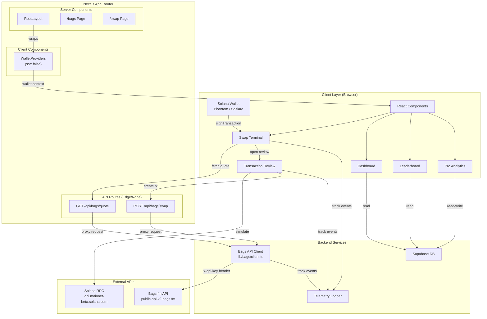

# BagFi Architecture

> Generated from GitNexus knowledge graph analysis  
> **Stats:** 809 nodes | 961 edges | 7 functional areas | 25 execution flows

---

## Overview

BagFi is a unified Web3 asset platform built on **Next.js 15** with **React 18**, focused on Solana-native portfolio management. The application consolidates fragmented crypto holdings into automated, thematic "Smart Bags" — one-click curated portfolios powered by the Bags.fm API.

The architecture follows a **hybrid server/client model**: sensitive operations (API auth, quote fetching, transaction building) run server-side via Next.js API routes, while wallet interactions and UI state management run client-side via Solana Wallet Adapter.

### Technology Stack

| Layer | Technology |
|-------|-----------|
| Framework | Next.js 15 (App Router) |
| UI | React 18, Tailwind CSS, Lucide Icons |
| Wallet | @solana/wallet-adapter-react (Phantom, Solflare) |
| Blockchain | @solana/web3.js |
| API | Bags.fm API v1 (server-side proxy) |
| Database | Supabase (PostgreSQL + Auth) |
| Telemetry | Custom event logger (Sentry-ready) |
| Smart Contracts | Solidity (Hardhat/Foundry) — migration in progress |

---

## Functional Areas

The codebase is organized into **7 functional areas** (clusters) identified by the knowledge graph:

### 1. App (3 symbols, cohesion: 1.0)
**Files:** `app/layout.tsx`, `app/providers.tsx`, `app/client-providers.tsx`

The application bootstrap layer. Uses dynamic imports with `ssr: false` for wallet providers to avoid server-side rendering issues with browser-only APIs. The root layout wraps all pages with Solana ConnectionProvider and WalletProvider.

### 2. Dashboard (5 symbols, cohesion: 0.89)
**Files:** `app/page.tsx`, `components/dashboard/*.tsx`

The main landing page showing portfolio overview. Components include:
- **NetWorth**: Displays total portfolio value with mock data (pending Solana RPC integration)
- **AssetAllocation**: Doughnut chart showing SOL, USDC, JUP, BONK allocation
- **HoldingsTable**: Detailed token holdings table

### 3. Swap (2 symbols, cohesion: 1.0)
**Files:** `components/swap/swap-terminal.tsx`, `components/swap/transaction-review-modal.tsx`

The token swap interface. Features:
- Token selectors (SOL, USDC, USDT, BONK, JUP)
- Slippage and deadline controls
- Bags.fm quote integration
- Transaction simulation before signing
- Review modal with route plan, price impact, and risk metrics

### 4. Bags (14 symbols, cohesion: 1.0)
**Files:** `lib/bags/client.ts`, `app/api/bags/quote/route.ts`, `app/api/bags/swap/route.ts`

The core Bags.fm integration layer. Server-side only:
- **bagsRequest()**: Generic API wrapper with auth, retries, rate-limit tracking
- **getTradeQuote()**: Fetches swap quotes from Bags /trade/quote
- **createSwapTransaction()**: Creates serialized swap transactions via Bags /trade/swap
- **API Routes**: Client-facing endpoints that validate input and proxy to Bags API

### 5. Leaderboard (9 symbols, cohesion: 0.89)
**Files:** `app/leaderboard/page.tsx`, `components/leaderboard/leaderboard.tsx`

Community leaderboard showing top-performing Smart Bags. Integrates with Supabase to fetch public user profiles.

### 6. Pro (3 symbols, cohesion: 0.8)
**Files:** `app/pro/page.tsx`, `components/pro/pro-dashboard.tsx`

Advanced analytics dashboard for Pro subscribers. Features historical PnL charts, impermanent loss tracking, and yield analytics.

### 7. Cluster_1 / Telemetry (7 symbols, cohesion: 1.0)
**Files:** `lib/telemetry.ts`, `lib/env.js`, `lib/database.ts`

Shared utilities:
- **Telemetry**: Event logging for API requests, swap transactions, simulations
- **Env Validation**: Runtime validation for Solana RPC, Bags API key, Supabase credentials
- **Database**: Typed Supabase client with repository helpers for users and portfolio snapshots

---

## Key Execution Flows

### Flow 1: Application Bootstrap
**Process:** `RootLayout → ClientProviders → WalletProviders`

```
1. RootLayout (Server Component)
   └── Renders HTML shell with fonts, metadata
   
2. ClientProviders (Client Component, ssr: false)
   └── Dynamically imports wallet providers
   
3. WalletProviders (Client Component)
   ├── ConnectionProvider (Solana RPC endpoint)
   ├── WalletProvider (Phantom, Solflare adapters)
   └── WalletModalProvider (connect UI)
```

**Key insight:** The `ssr: false` dynamic import is critical — wallet adapters use browser-only APIs (localStorage, window) that fail during Next.js static generation.

### Flow 2: Swap Quote Request
**Process:** `SwapTerminal → GET /api/bags/quote → Bags Client → Bags API`

```
1. SwapTerminal (Client)
   ├── User enters amount, selects tokens
   ├── Debounced fetchQuote() triggered (800ms)
   └── GET /api/bags/quote?inputMint=...&outputMint=...&amount=...

2. API Route: /api/bags/quote (Server)
   ├── Validates base58 mint addresses
   ├── Validates positive amount
   └── Calls getTradeQuote() from lib/bags/client.ts

3. Bags Client (Server)
   ├── Validates BAGS_API_KEY env var
   ├── Attaches x-api-key header
   ├── Makes request to https://public-api-v2.bags.fm/api/v1/trade/quote
   └── Returns normalized response with retry/rate-limit logic

4. SwapTerminal (Client)
   ├── Displays receive amount
   ├── Shows route plan and price impact
   └── Enables "Review" button
```

### Flow 3: Swap Transaction Execution
**Process:** `TransactionReviewModal → POST /api/bags/swap → Sign → Send → Confirm`

```
1. TransactionReviewModal (Client)
   ├── User clicks "Simulate Transaction"
   ├── Deserialize base64 transaction from quote
   ├── Connection.simulateTransaction() via Solana RPC
   └── Displays simulation result (success/failure + logs)

2. User clicks "Sign & Send"
   ├── POST /api/bags/swap with quoteResponse + userPublicKey
   
3. API Route: /api/bags/swap (Server)
   ├── Validates quoteResponse and userPublicKey
   └── Calls createSwapTransaction() from lib/bags/client.ts

4. Bags Client (Server)
   └── POST to https://public-api-v2.bags.fm/api/v1/trade/swap

5. TransactionReviewModal (Client)
   ├── Deserialize returned swapTransaction (base64)
   ├── wallet.signTransaction() — user approves in wallet
   ├── connection.sendTransaction() — broadcasts to network
   └── connection.confirmTransaction() — waits for confirmation
```

### Flow 4: Dashboard Load
**Process:** `Home → NetWorth → AssetAllocation → HoldingsTable`

```
1. Home page (Server Component)
   └── Renders dashboard grid layout

2. NetWorth (Client Component)
   ├── Checks wallet connection via useWallet()
   └── Displays mock total value ($12,450.75) + daily change

3. AssetAllocation (Client Component)
   └── Doughnut chart with SOL/USDC/JUP/BONK allocation

4. HoldingsTable (Client Component)
   └── Table of mock holdings with Solana network badge
```

### Flow 5: Leaderboard Data Fetch
**Process:** `LeaderboardPage → fetchLeaderboard → Supabase`

```
1. LeaderboardPage (Server Component)
   └── Renders page layout

2. Leaderboard (Client Component)
   ├── useEffect triggers fetchLeaderboard()
   ├── db.users.findManyByPublicLeaderboard(true)
   ├── Fetches from Supabase users table with RLS
   └── Combines real users with mock data for display
```

---

## Architecture Diagram



---

## Data Flow

### Wallet Connection Flow
```
User clicks "Connect Wallet" 
→ WalletModal opens (Phantom/Solflare)
→ Adapter connects to wallet extension
→ publicKey available via useWallet() context
→ All components re-render with connected state
```

### Swap Quote Flow
```
User types amount in SwapTerminal
→ debounced 800ms
→ GET /api/bags/quote (server)
→ validate base58 addresses
→ bagsRequest() adds x-api-key header
→ fetch Bags.fm /trade/quote
→ normalize response
→ return { inputAmount, outputAmount, routePlan, slippageBps }
→ display in SwapTerminal
```

### Transaction Execution Flow
```
User clicks "Review & Swap"
→ TransactionReviewModal opens
→ User clicks "Simulate"
→ deserialize VersionedTransaction from base64
→ Connection.simulateTransaction() via RPC
→ display simulation result + compute units
→ User clicks "Sign & Send"
→ wallet.signTransaction() — wallet popup
→ connection.sendTransaction() — broadcast
→ connection.confirmTransaction() — wait
→ display signature + confirmation status
→ Telemetry tracks swap success/failure
```

---

## Security Considerations

1. **API Key Protection**: `BAGS_API_KEY` is server-side only. API routes validate environment before proxying requests.
2. **Input Validation**: All API routes validate base58 addresses, positive amounts, and slippage bounds.
3. **Wallet Safety**: No private keys stored. All signing happens in user's wallet extension.
4. **Transaction Simulation**: Every swap is simulated before signing to catch errors early.
5. **Rate Limiting**: Bags client tracks rate limits and warns when approaching 1000 req/hour cap.

---

## Development Notes

### Build Requirements
- Node.js with legacy peer deps enabled (`.npmrc`)
- React 18.3.1 (wallet adapter compatibility)
- `.env` with: `NEXT_PUBLIC_SOLANA_RPC_URL`, `NEXT_PUBLIC_SOLANA_NETWORK`, `BAGS_API_KEY`, `NEXT_PUBLIC_SUPABASE_URL`, `NEXT_PUBLIC_SUPABASE_ANON_KEY`

### Known Issues
- Solana wallet adapter bundle includes EVM dependencies (viem via WalletConnect) — mitigated by individual adapter imports
- `@next/swc-darwin-arm64` may fail on macOS — falls back to WASM compilation

### Testing
- Hardhat tests for Solidity contracts (currently EVM, migrating to Solana)
- ESLint config v9 with ignores for test files

---

*Last updated: 2026-05-14*
