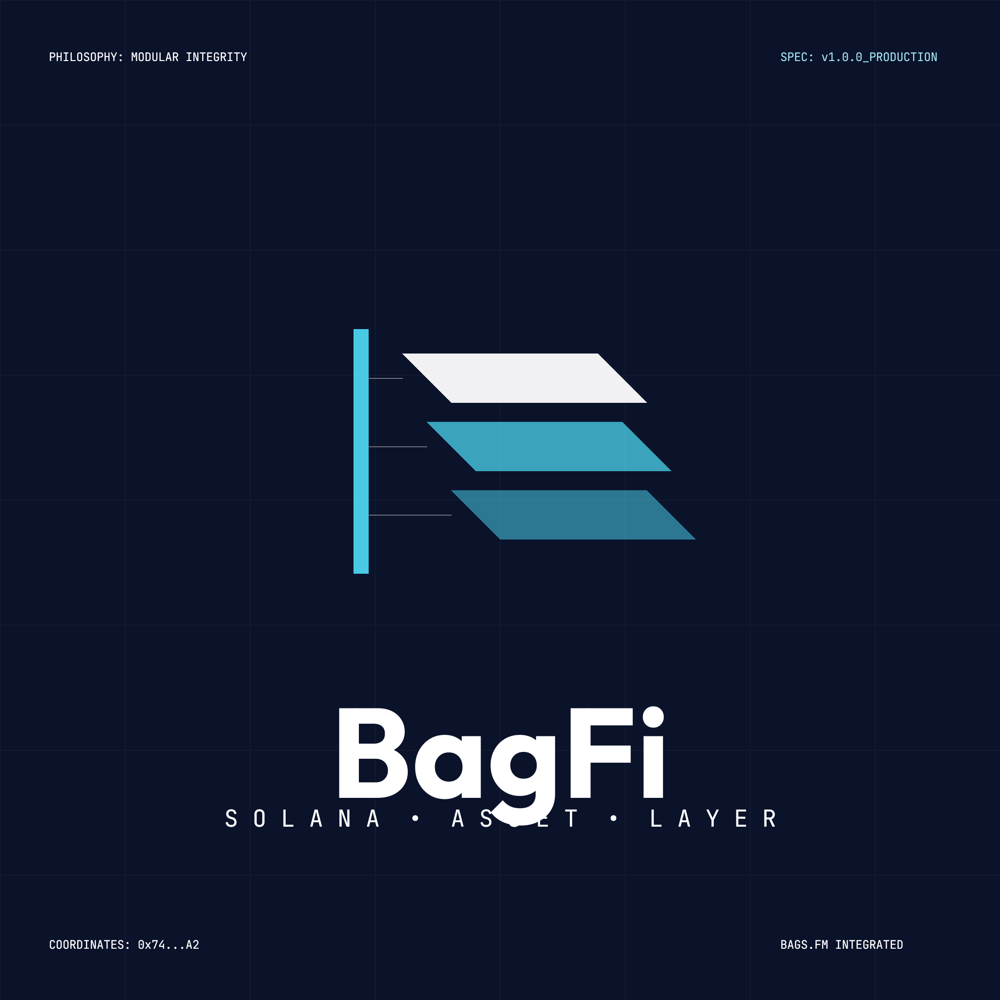

<div align="center">

</div>

# BagFi — Unified Solana Portfolio & Smart Bag Platform

BagFi is a professional-grade, hybrid Web3 asset platform designed to consolidate fragmented crypto portfolios into automated, thematic **"Smart Bags"** (one-click, non-custodial yield-generating portfolios). 

Integrating directly with the **Bags.fm API**, BagFi provides a unified interface for token discovery, risk scoring, fee-sharing launches, and partner revenue collection on the Solana blockchain.

---

## 🚀 Key Features

*   **💼 Smart Bags (Curated Baskets)**: Thematic portfolios (e.g. *Solana Blue Chips*, *DeFi Growth*, *Stable Reserves*) mapped via Basis Points (BPS). Powered by a multi-leg session engine that manages serialized transaction preflights and confirmation monitoring without central custody.
*   **🔍 Bags Discovery & Risk Filters**: Automatically caches Bags.fm token launches and pool data in Supabase. Determines a safety score (0-100) using liquidity depth, price-impact probes, social validation, and creator history to isolate eligible assets.
*   **🧪 Creator Lab (Launchpad)**: A guided 3-step token creation wizard enabling creators to mint metadata and set up automated, on-chain **Stakeholder Fee-Sharing Configs** immediately post-launch.
*   **💰 Earnings & Partner Centers**: Real-time monitoring of accrued SOL fee allocations with one-click, on-chain claim transaction simulations and wallet signing.
*   **📊 Pro Analytics**: Live visual tools (lifetime creator fees, distribution graphs, and dynamic token trackers) powered by Supabase caches.
*   **⚡ Modern Swap Terminal**: Built entirely on top of the Bags/Jupiter trade execution engine, featuring price-impact alerts, slippage caps, route planning, and mandatory pre-flight simulation reviews.

---

## 🏛️ System Architecture

BagFi operates under a **strictly non-custodial** hybrid architecture:

```
                  ┌──────────────────────┐
                  │   Next.js Frontend   │
                  │   (Solana Wallet)    │
                  └──────────┬───────────┘
                             │ (wallet sig / txn sign)
        ┌────────────────────┼────────────────────┐
        ▼                    ▼                    ▼
┌──────────────┐     ┌──────────────┐     ┌──────────────┐
│  Bags API    │     │  Supabase    │     │ Solana RPC   │
│ (Trade/Feed) │     │ (Cache/RLS)  │     │ (On-chain)   │
└──────────────┘     └──────────────┘     └──────────────┘
```

1.  **Frontend**: Next.js 15 (App Router) styled with premium, vanilla CSS themes. Uses the **Solana Wallet Standard** (Phantom, Solflare) for secure browser interaction.
2.  **Server API Proxy**: Next.js server routes proxy all privileged API requests (Bags.fm, Supabase), validating payloads to ensure critical endpoints are completely hidden from public client inspection.
3.  **Data Layer**: Supabase (PostgreSQL) stores public catalogs, discovery scoring, analytics, and session persistence. Leverages Row-Level Security (RLS) policies.
4.  **No-Touch Security Model**: Private keys never touch BagFi. Transactions are built server-side, simulated on-chain via RPC pre-flights, returned to the browser as serialized base64, and explicitly signed inside the user's wallet.

---

## 📂 Codebase Directory Layout

*   `app/` — App Router entry points, static views, and server-side API endpoints (`/api/bags/...`, `/api/users/...`).
*   `components/` — Modular, highly-styled React components (Dashboard, Smart Bags, Swap, Pro Analytics, Creator Wizard).
*   `hooks/` — Custom React hooks (wallet balance monitors, session tracking).
*   `lib/` — Standard infrastructure scripts:
    *   `lib/bags/client.ts` — Typed server-side Bags.fm API client with rate-limiting & retry telemetry.
    *   `lib/bags/discovery-cache.ts` — Discovery sync coordinates.
    *   `lib/bags/risk-scoring.ts` — Safety filter calculations.
    *   `lib/smart-bags/session-engine.ts` — Allocation splitting and multi-transaction tracking.
    *   `lib/solana/balances.ts` — RPC token fetcher and dynamic **Jupiter Price API v3** bulk integration.
    *   `lib/telemetry.ts` — observabilty services.
*   `supabase-schema.sql` / `supabase-rls-policies.sql` — SQL specifications for databases and RLS controls.
*   `test/` — Full automated unit and integration suite utilizing **Vitest**.

---

## 🛠️ Local Development Setup

### Prerequisites
*   Node.js (v18.x or newer)
*   Solana CLI (optional, for on-chain inspection)
*   A Supabase Project (free tier is fully compatible)

### Steps

1.  **Clone the repository**:
    ```bash
    git clone https://github.com/EKF0/bagfi.git
    cd bagfi
    ```

2.  **Install dependencies**:
    ```bash
    npm install --legacy-peer-deps
    ```

3.  **Configure environment variables**:
    Copy the sample configuration file and populate the required variables:
    ```bash
    cp .env.example .env.local
    ```
    *(Open `.env.local` and add your `BAGS_API_KEY`, Supabase URL/keys, and a custom RPC provider if mainnet rate limits are hit)*

4.  **Deploy database schema**:
    Run the SQL commands inside `supabase-schema.sql` and `supabase-rls-policies.sql` inside your Supabase project's SQL editor.

5.  **Run locally**:
    ```bash
    npm run dev
    ```
    Open `http://localhost:3000` to view the platform.

---

## 🧪 Testing and Verification

Ensure the platform works perfectly after making modifications:

*   **Run TypeScript & Solana Tests**:
    ```bash
    npm run test:ts
    ```
*   **Run Linter**:
    ```bash
    npm run lint
    ```
*   **Compile Build Bundle**:
    ```bash
    npm run build
    ```

---

## 💓 Background Maintenance ("The Heartbeat")

To ensure discovery data remains updated without exceeding the Bags API rate limit, BagFi utilizes a unified background fetch cycle.

Configure a trusted cron worker (e.g. Vercel Cron) to query the refresh route periodically:
*   **Endpoint**: `POST /api/bags/refresh`
*   **Interval**: Every 5 minutes (default `schedule` is configured inside `vercel.json`).
*   **Authorization**: Gated by `BAGS_CACHE_REFRESH_SECRET` or `CRON_SECRET`.
