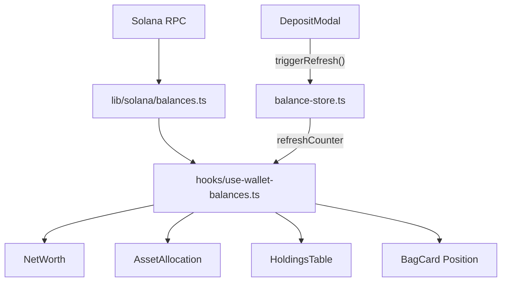

# Session Walkthrough

## 1. Vercel Fix & SOL2-04 Commit (PR #4)

SOL2-04 (Smart Bag deposit session engine) was fully implemented but never committed. All 22 changed files were sitting in the working tree, including the Vercel deploy fix.

**Vercel issues resolved:**
- Removed `@next/swc-darwin-arm64` from `package.json` dependencies — macOS-only SWC binary was causing `EBADPLATFORM` on Vercel's Linux build environment
- Fixed `vercel.json` — removed redundant `npm install` from `buildCommand` that was deleting `typescript` before `next.config.ts` loaded

**PR #4** created, merged to main, branch cleaned up.

---

## 2. SOL2-05: Portfolio Reconciliation (PR #5)

Replaced all mock/hardcoded data in the dashboard with real on-chain Solana wallet balances, with auto-refresh after any transaction.

### New Files

| File | Purpose |
|------|---------|
| [balances.ts](file:///Users/ekf/Downloads/Projects/bagfi/lib/solana/balances.ts) | Fetches native SOL + SPL tokens via `getBalance` + `getParsedTokenAccountsByOwner` |
| [balance-store.ts](file:///Users/ekf/Downloads/Projects/bagfi/lib/stores/balance-store.ts) | Zustand store with `refreshCounter` for cross-component refresh |
| [use-wallet-balances.ts](file:///Users/ekf/Downloads/Projects/bagfi/hooks/use-wallet-balances.ts) | React hook with auto-fetch and stale-fetch prevention |

### Modified Files

| File | Change |
|------|--------|
| [holdings-table.tsx](file:///Users/ekf/Downloads/Projects/bagfi/components/dashboard/holdings-table.tsx) | Removed `MOCK_HOLDINGS`, wired to real balances with loading/empty states |
| [net-worth.tsx](file:///Users/ekf/Downloads/Projects/bagfi/components/dashboard/net-worth.tsx) | Removed hardcoded `$12,450.75`, shows real `totalValueUsd` |
| [asset-allocation.tsx](file:///Users/ekf/Downloads/Projects/bagfi/components/dashboard/asset-allocation.tsx) | Dynamic doughnut chart from actual holdings, top asset computed |
| [deposit-modal.tsx](file:///Users/ekf/Downloads/Projects/bagfi/components/bags/deposit-modal.tsx) | Calls `triggerRefresh()` after confirmed deposit session |
| [bag-card.tsx](file:///Users/ekf/Downloads/Projects/bagfi/components/bags/bag-card.tsx) | Shows "Your Position" with actual vs. target allocation + drift |

### Architecture

### Validation
- `npm run lint` — 0 errors ✅
- `npm run build` — all 11 pages generated ✅
- No mock data remaining (`MOCK_HOLDINGS`, `12450.75`) ✅

### Known Limitations
- **USD pricing**: Uses a temporary hardcoded price map — real price feed integration is deferred to SOL3-01
- **Day change**: Shows `--` instead of daily % change — requires SOL6 Supabase historical snapshots
- **Token-2022**: Only queries the standard SPL Token Program; Token-2022 support can be added later

### Next Tasks (from roadmap)
| Task | Priority | Description |
|------|----------|-------------|
| **SOL3-01** | P0 | Ingest Bags token launch feed and pool state |
| **SOL6-01** | P0 | Design Supabase schema for Solana Smart Bags |
| **SOL7-01** | P0 | Add mocked Bags API and Solana transaction tests |
