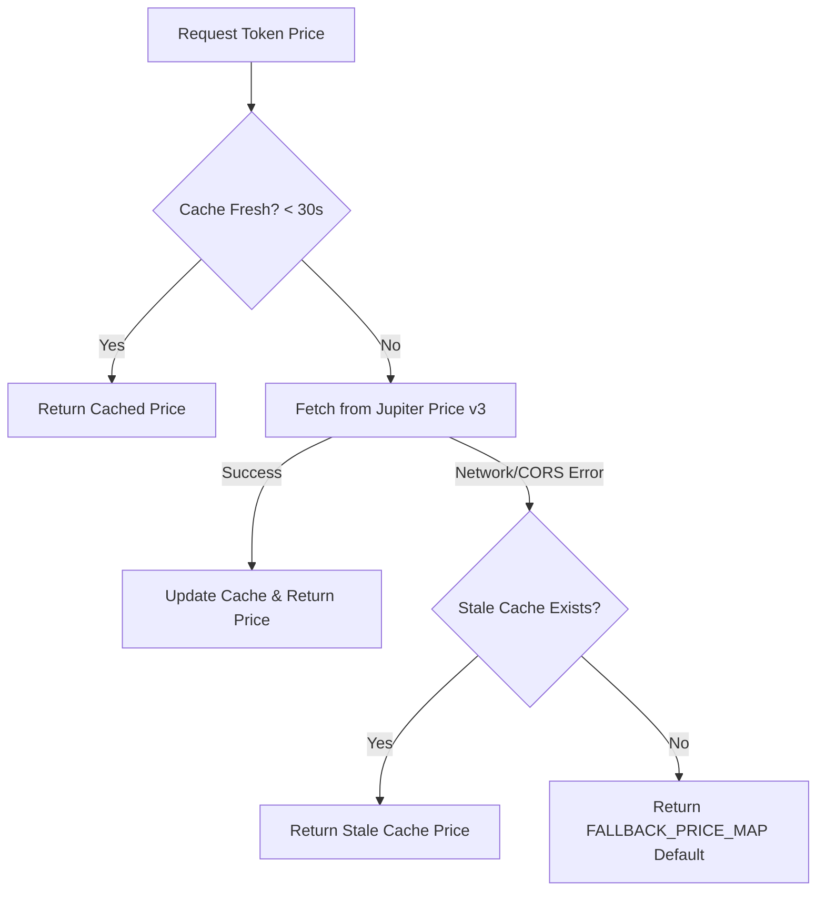

# P0-06 Report: Replace Hardcoded Portfolio Price Map with Real Price Source

Date: 2026-05-25
Task ID: P0-06
Area: Portfolio Dashboard & Pricing Infrastructure

## 1. Executive Summary

This task successfully replaces the static, hardcoded token price map inside the Solana balance resolver with a real-time dynamic pricing feed. We integrated the public **Jupiter Price API v3** to retrieve current prices in bulk for all tokens held in user wallets, while designing a robust, double-layered fail-safe mechanism:
1. **Dynamic Caching**: An in-memory cache temporarily stores retrieved pricing data for 30 seconds, preventing redundant HTTP requests and staying clean during fast-paced UI interactions.
2. **Deterministic Fallbacks**: If the network connection is lost or the Jupiter API is rate-limited, the utility automatically falls back to the in-memory cache or a hardcoded default price map, preventing portfolio crashes or blank values.

---

## 2. Changes Made

### Pricing Infrastructure
- **[balances.ts](file:///Users/ekf/Downloads/Projects/bagfi/lib/solana/balances.ts)**
  - Replaced the temporary `PRICE_MAP` with `FALLBACK_PRICE_MAP`.
  - Added a global `priceCache` variable to keep track of fetched prices and timestamps.
  - Implemented `fetchTokenPrices(mints: string[])` to query the public Jupiter Price API v3 (`https://api.jup.ag/price/v3?ids=...`) for bulk token pricing.
  - Updated `getWalletBalances` to gather all non-dust token mints (including native SOL) in user wallets, retrieve their real-time prices in a single API query, and dynamically assign the value.
  - Updated `getTokenPriceUsd` to leverage the cached dynamic prices synchronously when available.
  - Added `resetPriceCache()` as an exported test helper to clear cached price state.

### Automated Testing
- **[price-service.test.ts](file:///Users/ekf/Downloads/Projects/bagfi/test/price-service.test.ts) [NEW]**
  - Created a robust test suite covering successful dynamic bulk fetching, mock API integration, fallback pricing checks, and synchronous cached token price lookups.
  - Added a test validating that `getWalletBalances` properly prices, enriches, and sorts holdings descending by USD value.
  - Reset the price cache state inside `beforeEach` to guarantee test isolation.

---

## 3. Dynamic Pricing Integration Details

### API Endpoint & Response Format
The Jupiter Price API v3 public endpoint is queried:
`https://api.jup.ag/price/v3?ids=mint1,mint2...`

The JSON response is mapped to the token's active USD price dynamically:
```json
{
  "So11111111111111111111111111111111111111112": {
    "usdPrice": 86.0136,
    "decimals": 9,
    "priceChange24h": 0.866
  }
}
```

### Double-Layered Fallback Flow


---

## 4. Verification & Testing

### Automated Test Output
All Vitest unit tests pass successfully, confirming that the new pricing integrations compile and behave correctly under different simulated networks:
```bash
npx vitest run test/price-service.test.ts

 ✓ test/price-service.test.ts (4 tests) 6ms
 Test Files  1 passed (1)
      Tests  4 passed (4)
   Duration  331ms
```
Running the entire repository test suite (26 tests total):
```bash
npm run test:ts

 Test Files  6 passed (6)
      Tests  26 passed (26)
   Duration  481ms
```

### Types & Lint Checks
Checked typescript and eslint definitions to ensure compatibility with next.js compilation:
- `npm run lint`: **0 errors**, passed.
- `npm run build`: Compiled and optimized successfully, static and dynamic routes compiled perfectly.

---

## 5. Maintenance & Support Guide

1. **How to Force-Refresh Pricing**: The cache resets itself every 30 seconds automatically. If a manual reset is needed inside a transaction or swap flow, you can import and call `resetPriceCache()`.
2. **Adding New Supported Tokens**: To add a new asset's fallback price, simply add its mint address and default value to `FALLBACK_PRICE_MAP` in `lib/solana/balances.ts`. Since the dynamic fetch queries the user's actual holding mints, new tokens will naturally receive dynamic pricing from Jupiter without needing code updates as long as they are tradable on Jupiter.
